# Introduction

This project contains a web application based on Node-Red to measure force and tourqe using HX711 sensor. Special hardware attached on top of Raspberry Pi enables proper signal communication betweeen HX711 and RPI. There are 2 possibilities of communication:

1. SSH protocol (without graphical user interface)
2. VNC connection (with graphical user interface)

At the end of the project, Raspberry Pi should work as individual access point and execute Node-RED on boot. Description of this step is shown further in the project. Finally this project provides full measurement of a force and a moment of a force storing all measured data in the files.

This project contains general description of mechanical parts, GPIO definition and a
scheme presenting step by step how to calibrate individual forces. Full explanation of basic calculus and necessary blocks in Node-RED is provided as well. Short code overview and designed
graphical user interface in a web application is presented in the end o readme.

## Project guidelines:

* Define GPIO ( onoff node module is required)
* Calibrate raw data from sensors
* Compute for all sensors: a force and a moment of a force
* Implement graphical interface in Node-RED
* Documentation


## Sensor specification:
* Supply voltage: 2.6 V to 5.5 V
* Number of channels: 2
* ADC converter: 24-bit
* Preamplifier: low noise 32 / 64 / 128
* Updated frequency: 10 Hz / 80 Hz
* Pins: openings for goldpin connectors - 2.54 mm 
* Operating temperature: -20 °C to 85 °C
* Module dimensions: 33 x 20 mm


                        | PIN |                            DESCRIPTION |
                        | --- | -------------------------------------: |
                        | VCC |       Supply voltage from 2.6V to 5.5V |
                        | DAT |     Data line of the communication bus |
                        | CLK |    Clock line of the communication bus |
                        | GND |               The ground of the system |
                        | E + |                                        |
                        | E - |                                        |
                        | A - |                                        |
                        | A + | Lines to connect the strain-gauge beam |
                        | B - |                                        |
                        | B + |                                        |


<p align="center">
  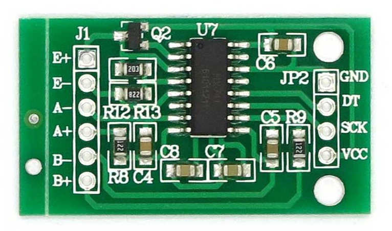
</p>

<p align="center">
  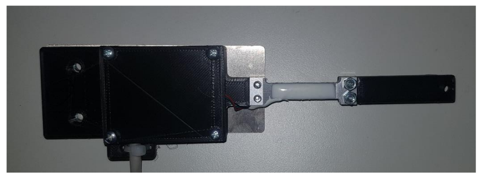
</p>
A mechanical case presented above protect this sensor against damage and provides a lever to measure a force and a moment of force. There are six sensor connected to the expansion hat. This half-bridge load cell can measure up to 50kg depending on a tensometric beam.

<p align="center">
  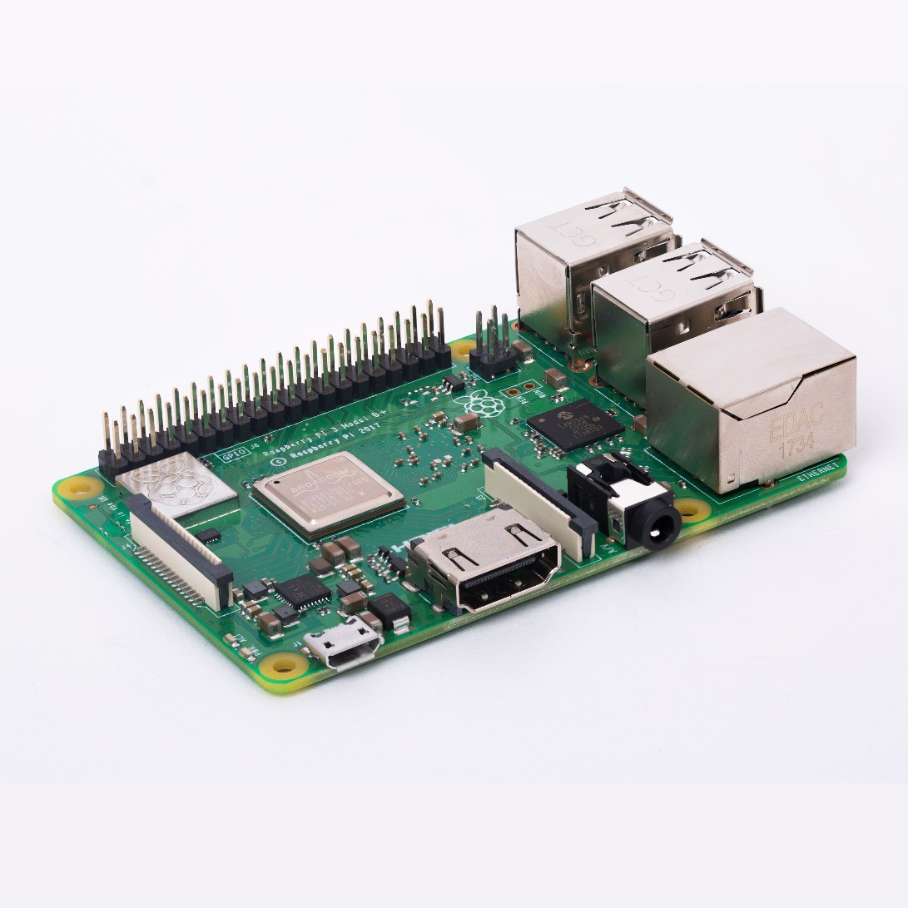
</p>

Raspberry Pi is a miniaturized computer, works as an embedded system and is applied to execute program in Node-Red. Special attached I/O expansion hat enables to read data from the sensor in a real time. 

## Definition of GPIOs:

<p align="center">
  
</p>

1. __Name:__ 	- select the name of your node for easy identification.
2. __dout:__ - select the DOUT pin (BCM) on your Pi.
3. __sck:__  - select the SCK pin (BCM) on your Pi.
4. __gain:__ - select signal amplification gain, 128 and 64 uses port A of the chip, 32 uses port B
5. __tare:__ - select offset value for tare (optional).

Recording to the difference between RPi pins order and Node-RED, in selected input “hx711”, all properties were changed and assigned to the following  BCM numbers:

| Sensor |  SCK  | dout |
| ------ | :---: | ---: |
| 1      |  17   |    4 |
| 2      |  22   |   27 |
| 3      |   9   |   10 |
| 4      |   5   |   11 |
| 5      |  13   |    6 |
| 6      |  26   |   19 |

## Force calibration

<p align="center">
  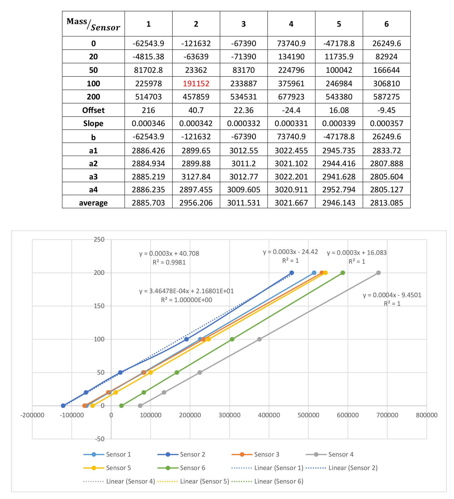
</p>

To achieve the correct calibration of all sensors, four measurements were done with the following weights: 20g, 50g, 100g, 200g and one without. Based on the results of signal values, the graph with the table was created. All average values from individual sensor were insert into the formula shown beneath. Every linearized function was calculated by the following mathematical formula:
The linearized function (1) represents an equation of a straight defined by a calibrated sensor. At the moment variables a and b are unknown.

<p align="center">
  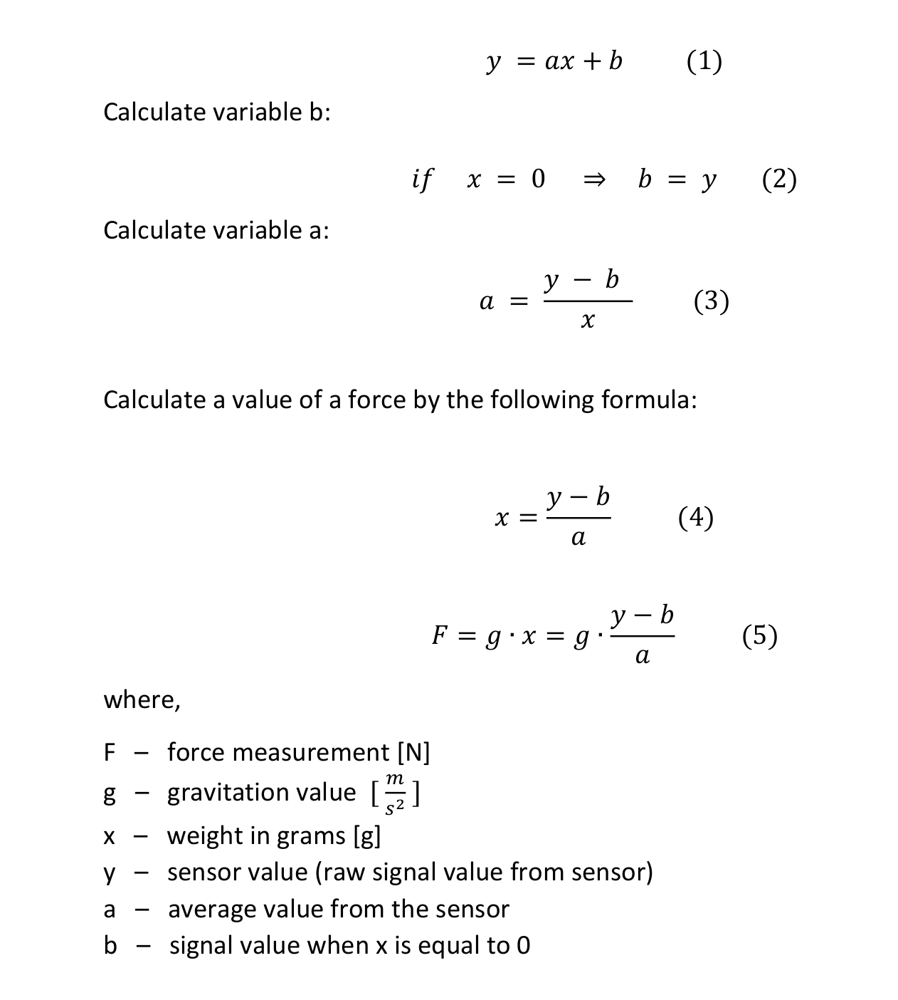
</p>

After calibration the next step is to limit a force in a range from 0 to 2 N and
round the result value to the hundredth fraction. Full code is located in a node
called <b><i>ConvertToForce</i></b>.

<p align="center">
  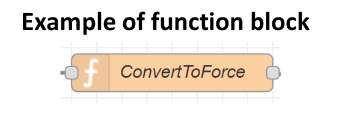
</p>

A JavaScript function block allows to write a code in javascript programming
language. A JavaScript object is kept in a message called msg. A node called
ConvertToForce contains complete function to get current time, calculate force and
moment of a force. The message is send in an object of the following structure:
```json
{
"time": "20:55:59", // get current time
"MyForce": 0.05, // value of a force
"Moment": 0.25 // value of a moment
}
```
<p align="center">
  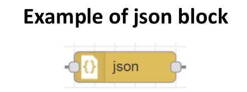
</p>
JSON ( JavaScript Object Notation) is a standard way for representing a JavaScript
object as a String. It is commonly used by web APIs to return data. The main idea
of JSON format is to represent and store data that is easily readable.

<p align="center">
  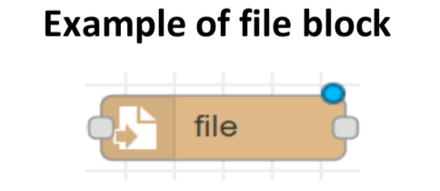
</p>

This block is responsible for saving all <b><i>msg.payload</i></b> into the specified file path.
Filename should include the full path to the folder in which all data is stored. If file doesn’t exist, then will be automatically created:
```bash
/<path>/.node-red/node_modules/node-red-contrib-hx711/Data/Sensor_I.log
```
The path must be changed.

### Example of application in the Node-RED flow:

<p align="center">
  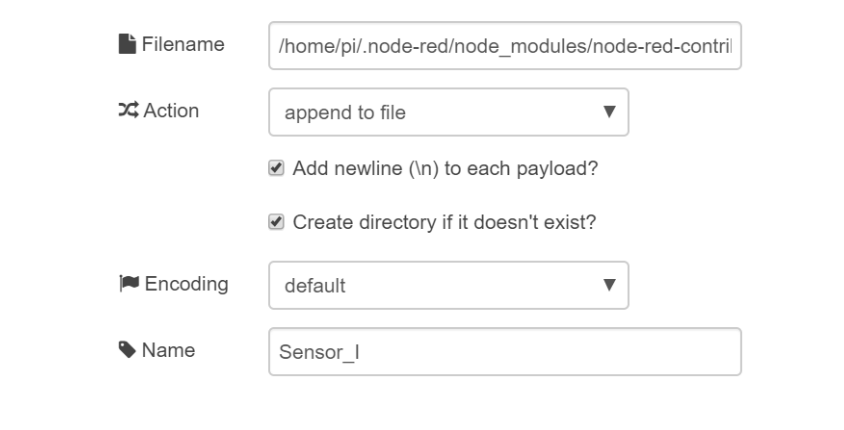
</p>

<p align="center">
  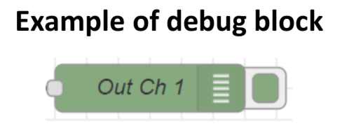
</p>

This block helps in debugging. This tool is useful whenever something does not work
properly. An example of use is shown below.

<p align="center">
  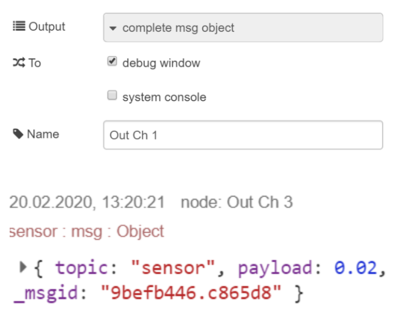
</p>

<p align="center">
  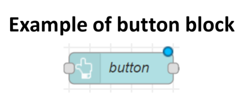
</p>

A button element is triggered by an inject input and allows to delete all stored
data from sensors in separate files. Node <b><i>ConvertToForce</b></i> contains the following code:

```javascript
var date = new Date();  // get actual date
var hours = date.getHours();    // get hours
var minutes = date.getMinutes();    // get minutes
var seconds = date.getSeconds();    // get seconds

if(hours < 10) hours = "0" + hours; // fix time representation
if(minutes < 10) minutes = "0" + minutes;
if(seconds < 10) seconds = "0" + seconds;
var time = hours + ":" + minutes + ":" + seconds;   // store actual time in a variable
var raw = msg.payload;  // assign a sensor value to variable raw

var newforce = 9.81*(raw + 62543)/(2884*1000); // calculate force
var Force = Math.round(newforce*10)/100;    // round force value to 0.01

// Define coordinates (distance)
var x0 = 10;
var y0 = 10;
var x1 = 1;
var y1 = 1;

xdifference = x1 - x0;
ydifference = y1 - y0;

Math.pow(x0, 2)
var Moment = Force * (Math.sqrt(Math.pow(xdifference, 2) + Math.pow(ydifference, 2)));
payload = {time, Force, Moment}

// create an object
msg.payload = payload;

// add object to the message
return msg;
```
<p align="center">
  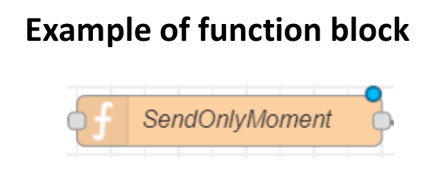
</p>

A node called <b><i>SendOnlyMoment</b></i> provides data type conversion and sends
only the value of its object property “Moment”. Included code looks like
one presented below:

```javascript
var nmsg = msg.payload;
payload = mymoment;
var mymoment = msg.payload.Moment;
msg.payload = mymoment;
return msg;
```
<p align="center">
  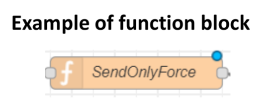
</p>

Analogically <b><i>SendOnlyForce</b></i> sends only the value of a Force.

```javascript
var nmsg = msg.payload;
payload = myforce;
var myforce = msg.payload.Force;
msg.payload = myforce;
return msg;
```

## Moment of a force

IMG

The moment of a force is the tendency of some forces to cause rotation. In this
project rotating propeller causes change of a moment whenever direction of a
screw is changed. A schematic idea of sensors position is presented below. The
distance between two points must be defined in the node <b><i>ConvertTheForce</b></i> as well
as an angle of force depending on a angle position of a screw. (It is represented as
X in the image)

The moment of a force is calculated according to the following equation:

# Graphical User Interface

The GUI is presented in a form of web application that runs as a client (in a browser),
connection is provided by WiFi from RaspberryPi that work as an access point.

<p align="center">
  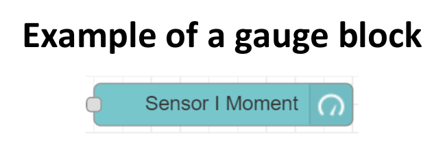
</p>

This node adds a guage type widget to the user interface. The <b><i>msg.payload</b></i> is
searched for a numeric value and displayed as a regular gauge, donut, compass or
wave. The label can also be set by a message property by setting the field to the
name of the property, for example <b><i>{{msg.topic}}</b></i>.

<p align="center">
  
</p>

The same function according to the Force is provided by a differently called node.
A gauge widget is shown below.

<p align="center">
  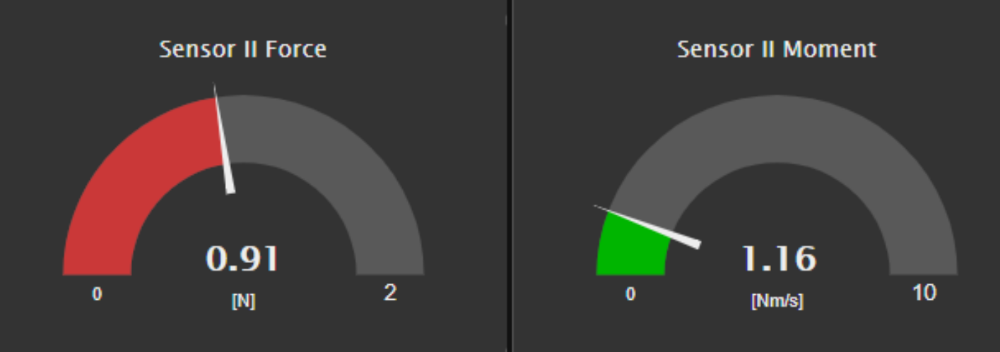
</p>

There are two different types of guage to separate shown in live time values of a
force and the moment of a force. The value is send every second and shown above
the label with defined unit.

<p align="center">
  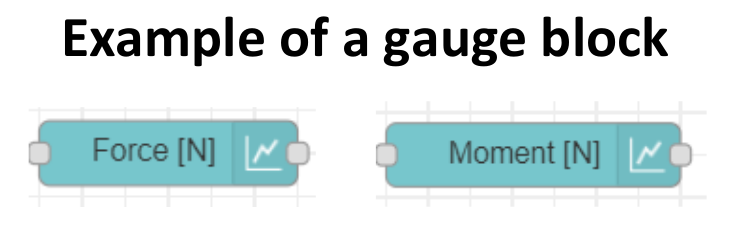
</p>

This chart plots the input values on a diagram. In this case all values from sensor
appear on a linear chart. Axes with time and the range of value can be changed as
well. This can be either a bar or pie chart. Each input msg.payload value is converted
to a number. If the conversion fails, the message is ignored. More information
about chart properties are well described in a node help section. A button under
both charts is used to delete all data from saved files. It doesn’t affect live time
diagram view. There is an image of overviewed charts below.


<p align="center">
  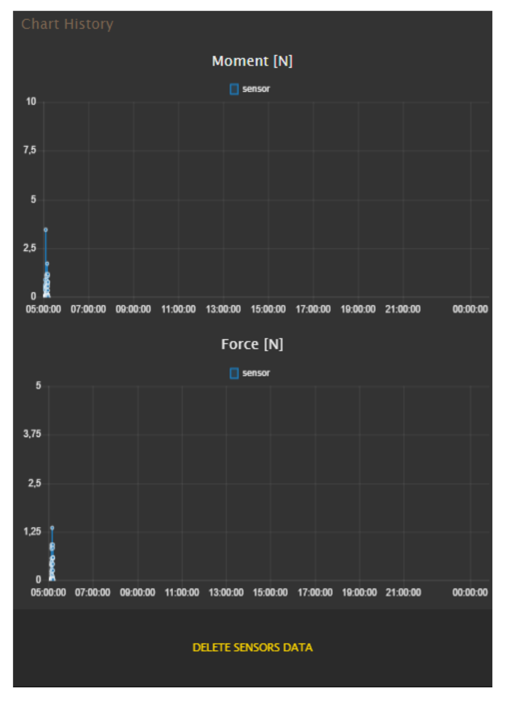
</p>

Node-RED makes it easy to save, share and move flows between computers using
the export and import feature. Flows are exported as a JSON file and imported from
a JSON file. Flows can be exported in parts or as an entire flow. To copy the flow
click <b><i>Menu -> export -> clipboard</b></i>. There is an option to download the file or copy
it to the clipboard. The full version of the project is attached as in a file flows.json.
The result of this flow is presented below.

<p align="center">
  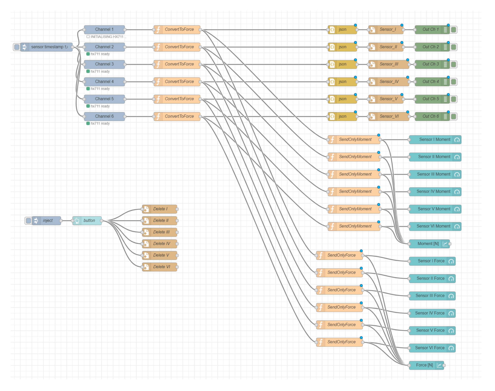
</p>

There is also a possibility to set up RaspberryPi as an access point and run Node-
RED on reboot. This is essential to run a program on Raspberry automatically.


## Conclusions

Node-RED is a very useful tool for integrating IoT devices in applications such as home
automation or rapid prototyping. It is based on a very efficient technology – Node.js and benefits from the one of the top popular language JavaScript. Process in creating web applications can be achieved much faster because of already existing node blocks. All need to be done is its configuration. Most of the modules can be changed using HTML with CSS as well.
JSON format brings in easy-to-read metadata and is commonly used together with
other modern web technologies. Flow-based programming makes programming
easier but it has also limits in its functionality. It is also possible to contribute your own
Node-RED module to extend functionality of sensors and provide new open source software for the
community.